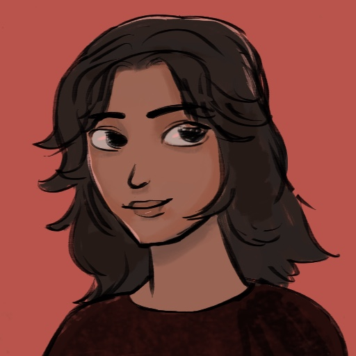
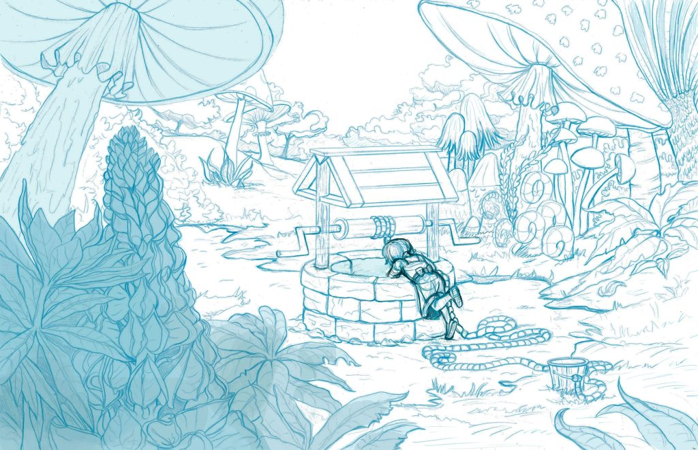
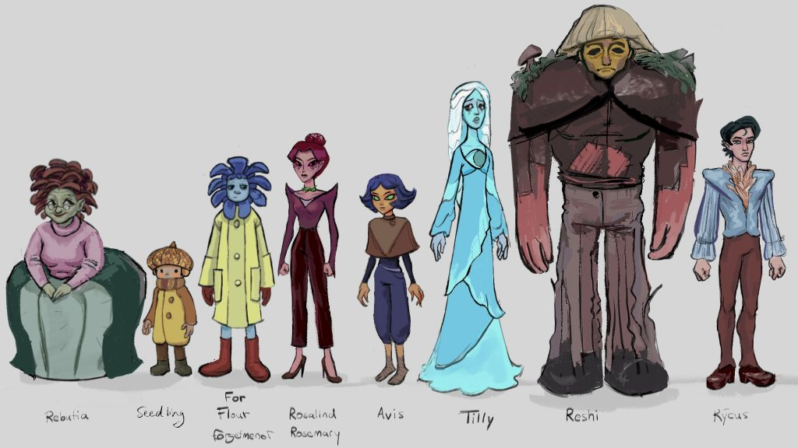
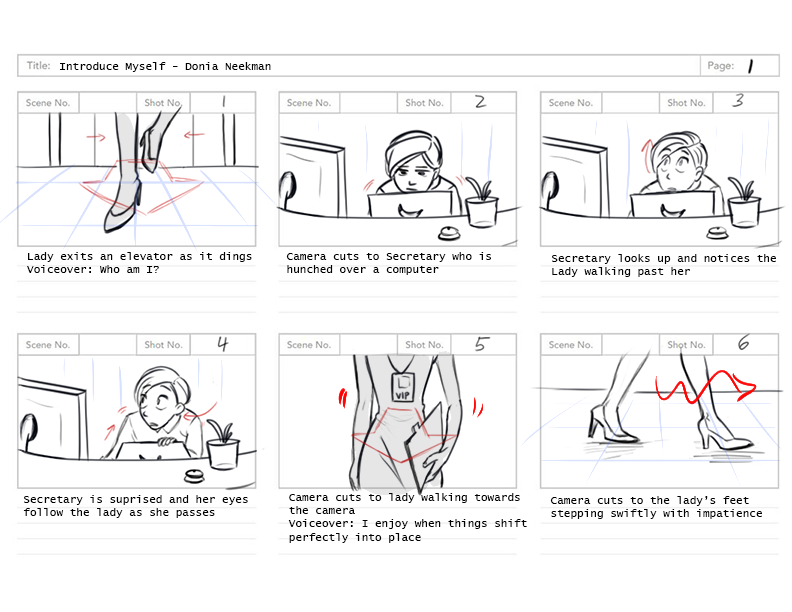

# Visual Artist & Character Designer

## Hire DoniArt

Hi! I'm DoniArt, a visual artist passionate about bringing stories to life through art. I specialize in character design, visual development, and creating immersive worlds that captivate audiences.

### Portfolio Highlights

### What I Do

- **Character Design** - Creating memorable characters with unique personalities
- **Visual Development** - Building immersive worlds and environments
- **Storyboarding** - Visual storytelling for animation and games
- **Illustration** - Professional artwork for various media

### Get In Touch

🎨 **Portfolio**: [doniart.com](https://doniart.com)  
✉️ **Email**: donartyx@gmail.com  
💼 **LinkedIn**: [linkedin.com/in/donia-liu-neekman](https://www.linkedin.com/in/donia-liu-neekman/)  

Ready to bring your vision to life? Let's create something amazing together!
